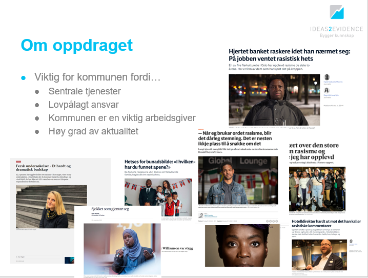
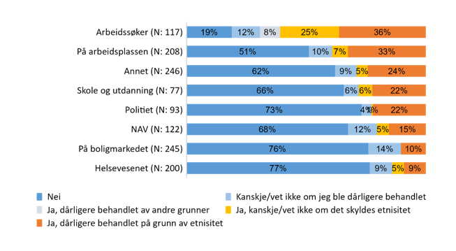
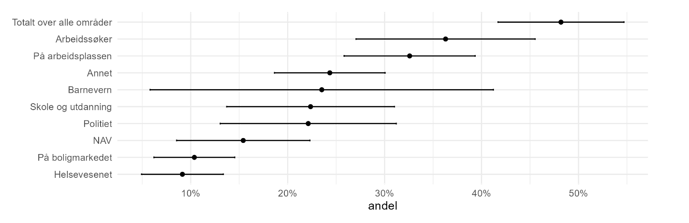

God kveld!

Oppdraget vi fikk fra kommunen var å kartlegge omfanget av rasisme og diskriminering i Haugesund. Det gjør vi på to måter. For det første så finner vi ut av hvor utbredt det er med diskriminering. For det andre skal så finner ut hvordan disse situasjonene kan arte seg og hvordan de oppleves, ved å sette noen menneskelige ansikter på tallene.

# Hvorfor er dette viktig for kommunen? 

Dere leverer mange viktige tjenester og tilbud – på kultur, idrett og frivillighet, helse og omsorg, skole, NAV, barnevern. Opplevelser av diskriminering vil gå imot det som disse tjenestene ønsker å oppnå, og det er utfordringer som f.eks. helsetjenester eller NAV vil måtte bøte på.

Kommunen har et lovpålagt ansvar for å holde oversikt over faktorer som påvirker folkehelse. Opplevelse av diskriminering er en slik faktor. Kommunen har også en aktivitets- og redegjørelsesplikt etter likestilling og diskrimineringsloven. Mobbeloven for skolen er også aktuell. Det er altså snakk om et lovpålagt ansvar for å holde oversikt – og gripe inn hvis det skjer ting. 

Et tredje perspektiv er at kommunen er en veldig viktig arbeidsgiver. Arbeidsplassen og arbeidssøking er blant områdene hvor innvandrere melder om mest diskriminering. Det er nok ikke ønskelig for en arbeidsgiver. 

Dette er dessverre også en veldig aktuell problemstilling. Her er noen medieoppslag fra siste halvår i fjor – en undersøkelse i Oslo, omfang av rasisme i Stavanger, Atle Antonsen-saken, Tinashe Williamson, hets av bunadsbilder…

 

# Veldig veldig kort om definisjoner, metode.

En kan bruke mye tid på å snakke om definisjoner og teori her. Vi nøyer oss med å konstatere ganske kort at det etter hvert er en enighet i fagmiljøene om hva rasisme og diskriminering er.Vi snakker hovedsakelig om rasisme som holdninger, der en person tillegges negative egenskaper på grunn av gruppemedlemskap, og det kan være gruppemedlemskap som hudfarge, religion, språk eller kultur. 

Etnisk diskriminering er derimot handlinger, der en behandles dårligere enn andre på grunn av hudfarge, språk eller nasjonal bakgrunn.

I dette prosjektet har det vært viktig for oppdragsgiverne våre å få vite noe om hvordan det oppleves å bo i Haugesund for den enkelte. Derfor har vi vært opptatt av, å finne ut av folks egne erfaringer – har du opplevd diskriminering? Har du blitt utsatt for noe motivert av rasisme? Hvordan er hverdagen i Haugesund for deg?

For å måle det har vi gjennomført en spørreundersøkelse blant innvandrere og norskfødte med innvandrerforeldre i Haugesund. Vi har gjennomført undersøkelsen slik at den skal være representativ. Det vil si at tallene vi bruker, sier noe om forekomsten av diskriminering i gruppa som helhet. 

Vi har konsentrert oss om de som har bodd i Norge i minst to år, og som har bakgrunn fra land i Afrika, Asia, Latin-Amerika og Øst-Europa.  Det betyr at Norden, Vest-Europa og Nord-Amerika, Australia er holdt utenfor.

Vi har også gjennomført 24 intervjuer med folk, en god del av dem her på biblioteket i Haugesund, men også en del på telefon. 

# Hvor mye diskriminering er det, totalt sett?

Når vi ser på datamaterialet vårt samlet sett, så kan vi gi et tall på hvor stor andel som i løpet av det siste året, har opplevd minst ett tilfelle de oppfatter som etnisk diskriminering, på minst ett av områdene vi har spurt om. Altså blitt behandlet annerledes enn andre på arbeidsplassen eller på gata, eller et annet område, fordi de har en anna hudfarge, snakker et anna språk, kommer fra et anna land. 

Hvor stor andel av innvandrerne og norskfødte med innvandrerbefolkningen i Haugesund tror dere har opplevd dette?

**48 prosent** har opplevd å bli behandlet dårligere enn andre på grunn av etnisitet eller nasjonal opprinnelse minst en gang i løpet av de siste 12 månedene, på minst ett av områdene vi spør om.

Når vi ber folk tenke lenger tilbake på opplevelser i Haugesund, så øker andelen. **Mellom 60 og 70 prosent** har opplevd minst et tilfelle av diskriminering på disse områdene. 

Hvordan er dette, sammenliknet med ellers i landet? Sammenlikningen er ikke helt rett frem, ettersom en i nasjonale undersøkelser har spurt om færre områder, andre typer diskriminering, andre utvalgte grupper, og så videre. 

Etter hva vi kan se, er en forsiktig tolkning av datagrunnlaget at omfanget av diskriminering er minst like stort i Haugesund som ellers i landet.

Vi spør om en rekke områder - vi spør om diskriminering som arbeidssøker, på arbeidsplassen, i skole og utdanning, på boligmarkedet, i møte med fire ulike offentlige tjenester, og på andre hverdagsarenaer som på bussen og butikken.

De fleste som har opplevelser med diskriminering, har opplevd det på ett eller to av områdene. Det er en liten andel - 8 prosent - som melder om at de har opplevd minst ett tilfelle av diskriminering på fire til seks av områdene. 

#	Arbeidssøker

36 prosent av de som har søkt jobb det siste året, mener de har blitt etnisk diskriminert i en jobbsøker-prosess. Altså at de ikke har fått jobben, selv om de var kvalifisert, på grunn av sin etnisitet eller nasjonale bakgrunn. 

Her er det noen tall jeg ikke viser: det er jo da 64 prosent av de som har søkt jobb, som har svart noe annet. Det er en andel – 19 prosent her – som oppgir at de ikke har blitt diskriminert når de har søkt arbeid. Og så er det ulike typer usikkerhet på de resterende. 

Når vi har intervjuet folk, så er dette med å søke arbeid noe alle har hatt erfaring med. Flere har et inntrykk av at de med utenlandske navn og utseende, møtes med fordommer om dårlig norsk og manglende kvalifikasjoner. Samtidig forteller de da at personer med tilsvarende kvalifikasjoner, men etnisk norsk bakgrunn, får jobben i stedet. For noen har dette skjedd en gang, mens andre har opplevd det flere ganger.

*Et aktuelt sitat her: "Jeg kjenner flere fra hjemlandet mitt som bytter navn bare for å få jobb. Det bør ikke være nødvendig. Men når jeg har et muslimsk navn på min CV, ringer de aldri tilbake."*

Særlig tre informanter (alle i begynnelsen av 20-årene) fortalte at de opplevde at deres norske venner med tilsvarende kvalifikasjoner fikk jobb, men ikke dem selv. 

Vi vet ikke om det faktisk var diskriminering. Dette er også informantene opptatt av - de har jo ikke innsyn i nøyaktig hva som skjedde. Men når det skjer flere ganger, og de kjenner til dem som får jobben og deres kvalifikasjoner, da sprer det seg et inntrykk. Vi veit også fra anna forskning at sannsynligheten for å bli innkalt til jobbintervju blir redusert med 25 prosent, hvis du har et utenlandskklingende navn - men ellers er helt lik.

# Arbeidshverdagen

33 prosent av de som var i jobb i løpet av det siste året, har opplevd diskriminering på arbeidsplassen. Vi har også spurt alle om hvor ofte dette forekommer. Omtrent halvparten sier at dette forekommer månedlig eller oftere.

Dette er i tråd med annen forskning. Det er etter hvert svært godt dokument at diskriminering forekommer i arbeidsmarkedet. 

Fra informantene våre får vi en forståelse av at diskriminering på arbeidsplassen kommer i mange former og med ulik styrke. 

Vi har fått høre om sporadiske nedsettende kommentarer fra kunder eller brukere. Det kan handle om tydelige rasistiske utsagn, kanskje fra pasienten på helseinstitusjonen, passasjeren i taxien eller kunden på butikken. Mange sier at dette ikke påvirker dem noe særlig. Noen forteller at det er alt for vanlig til at de legger merke til det, mens andre at det er leit, men de får god støtte fra sjefen og kolleger.

Andre historier vi har fått fortalt fra arbeidshverdagen, har tydelig gått sterkt inn på informantene. Det gjelder særlig når diskrimineringa kommer fra kolleger eller ledere. 

Noen forteller at det skjer litt indirekte, ved at de ikke blir tatt like mye på alvor som andre kolleger. Innspill og forslag blir ikke tatt seriøst, før de kommer fra noen med etnisk norsk bakgrunn. For andre er det mer direkte. En person vi snakka med sa det slik: 

*"Jeg ser at assistenter og helsefagarbeidere får kommentarer [fra kolleger]. De har utdanningen og er kvalifisert for den jobben de skal gjøre, men fordi de snakker annerledes, får de plutselig kommentarer på at de snakker dårlig, gjør jobben dårlig og ikke kan jobben. Det viktigste burde vel være å gjøre jobben, ikke det å snakke som nordmenn?"*

Denne informanten fortalte om hvordan tilbakemeldinger på språk fra kolleger, slås sammen med tilbakemeldinger om innsats og kvalifikasjoner. Flere av informantene våre snakket om at de hadde opplevd dette. Først hadde de forsøkt å jobbe hardere, gjøre ting riktig, for å bevise at de kunne jobben. De har da gjerne etter hvert kommet til at det ikke er mulig å bevise at de er dyktige nok. Mange har vært veldig opptatt av å vise fram bevis på at de er flinke arbeidstakere, og tatt med dokumentasjon på det til oss i intervjuene.

Vi har også fått historier fra personer som opplever å ha kollegaer som alltid kommer med nedsettende kommentarer om religion og andre ting ved seg. De har forsøkt å ta det opp med nærmeste leder og verneombud, men har opplevd prosessen med megling som veldig vanskelig. Det blir fort ord mot ord. 

# Skole og utdanning

Blant de som har gått på skole i Haugesund det siste året (både videregående og voksenopplæring er mulig her - husk, vi har spurt alle fra 16 år og oppover), så har 22 prosent opplevd etnisk diskriminering. Av disse, sier over halvparten at det forekommer månedlig eller oftere.

Vi har dessverre fått inn en del eksempler gjennom intervjuene våre. Noen informanter forteller om situasjoner med medelever i form av verbale uttrykk; nedsettende kallenavn og kommentarer. Vi har også snakket med informanter som forteller om hvordan rasistisk motivert mobbing ikke blir tatt på alvor av de ansatte i skolen. 

Fra voksenpersoner i skolen, som lærere og andre ansatte, er slike opplevelser ikke like direkte, men heller opplevelsen av at den voksne har et negativt bilde av deg basert på antakelser og fordommer om innvandrere. Vårt inntrykk fra intervjuene er at særlig elever med muslimsk bakgrunn er utsatt for slik diskriminering.

Vi har blant annet dette sitatet: *"I en periode hadde jeg det ganske dårlig og jeg følte meg nede. De ansatte på skolen merket det og kalte meg inn til en samtale. Jeg forventet at vi skulle snakke om skoleåret og hvordan vi fremover kunne gjøre det bedre, men det eneste vi snakket om var hvorvidt jeg kjente noen som var med i IS. Vedkommende spurte om jeg hadde holdt i våpen og om jeg hadde skutt før. Det var absolutt uakseptabelt."*

Tilfeller som dette kan ha store konsekvenser for den enkelte. Ingen skal behøve å bli utsatt for mobbing. Vi veit fra anna forskning at det er en sammenheng mellom trivsel og skoleprestasjoner. En annen informant fortalte at vedkommende hadde seg nødt til å bytte skole og fullføre utdanningen sin i en annen by, på grunn av rasistisk motivert mobbing fra medelever. Det er ganske drastisk i et ungt menneskes liv.

# Møte med offentlige tjenester

De offentlige tjenestene vi har spurt om, er NAV, Helsevesenet, Barnevernet og Politiet. Barnevernet er det rett og slett for få personer i utvalget vårt som har vært i kontakt med det siste året. Det er egentlig som forventa. Det er fortsatt noe færre har kontakt med enn f.eks. helsevesenet - som veldig mange har vært i kontakt med.

Relativt til arbeid og skole, så er det langt lavere andeler som melder om opplevelser med diskriminering her. Totalt sett er det 17 prosent av alle de spurte som melder om en opplevelse i møte med minst en av disse, det siste året.

- Politi: 22 prosent av de som har vært i kontakt med politiet det siste året, oppgir at de har opplevd etnisk diskriminering. 
- NAV: 15 prosent. 
- Helsevesenet: 9 prosent. 

Blant de vi intervjua, så var det få som hadde opplevd diskriminering eller rasisme i møte med offentlige tjenester. 

Det er et par personer som har erfaringer med møte med politiet: *"Før kunne jeg ble stoppet av [politiet]. Jeg vet ikke om jeg vil kalle det for rasisme. Men det var når jeg var med mine utenlandske venner, ikke norske, at jeg ble stoppet. Men det var ikke noe alvorlig. Bare kontrollspørsmål. (…) [jeg] opplever at det er pga. hudfarge og bakgrunn."*

Det var også en informant som fortalte at hun hadde fått spørsmål om «hvorfor hun ikke dro tilbake til landet sitt», når hun ønsket å melde seg som arbeidsledig. Det oppfattet hun som upassende. 

Ellers var mange av informantene våre opptatt av å snakke om hvor godt mye fungerte, og at hvis de hadde trengt hjelp eller støtte, så hadde de fått det. Her ser vi at noen av personene med fluktbakgrunn, trekker paralleller med hvordan de ble behandlet av offentlige myndigheter mens de var på flukt. 

Men vi ser jo av tallene at det definitivt er noen som har slike erfaringer.

# Oppsummering - og konsekvenser

Så oppsummert: Det er en god del haugesundere som opplever etnisk diskriminering, på ulike områder – 48 prosent har en opplevelse i løpet av det siste året. Det gjør at problemet er minst like vanlig i Haugesund, som ellers i landet. Særlig på arbeidsplassen og som arbeidssøker – men også innen skole og utdanning, og i møte med politiet. 

- Noen situasjoner fremstår åpenbart rasistisk motiverte for dem som opplever det, andre er skjulte og vanskelige å gripe tak i. 
- Noen er komfortable med å si ifra, mens andre ikke er det. 
- Noen opplever god støtte fra kolleger eller tilfeldig forbipasserende, men langt ifra alle.

Vi veit fra anna forskning at diskriminering har konsekvenser. Det kan føre til at en ikke får jobb, noe som er alvorlig. Det kan gi dårligere boforhold, noe som ikke er bra.  Det kan gi tilbaketrekning fra noen områder, som sosialt liv i byen eller deltakelse i frivillige organisasjoner. Det kan også påvirke fysisk og psykisk helse. 

Noen av informantene våre forteller historier som går i denne retningen. Hvordan diskriminering hindrer dem fra å få et godt liv i Haugesund. Her forteller de gjerne om konkurransesituasjoner, som jobbsøking eller boligjakt, hvor de opplever å komme dårligere ut enn andre. Noen opplever også at innsatsen de legger ned for å bli integrert, aldri vil være god nok etter enkeltes syn. Enkelte sier da at de forstår dem som holder seg utenfor arbeidslivet, eller at de kunne tenke seg å flytte ut av Haugesund og Norge.

