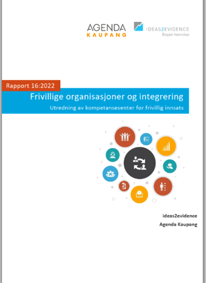

Når jeg vokste opp, var det mange tenkte på gateslaget i Brumunddal 1991. Noen her som husker det? Arne Myrdal og «Folkebevegelsen mot innvandring» skulle mane brumunddølene til kamp mot innvandrere en dag i august 1991. Tanta mi var ute på handletur, og trilla søskenbarnet mitt rundt i barnevogn. Hun måtte bare springe og gjemme seg. Flasker og balltre føk rundt. Det endte med at en mobb med «innvandringsmotstandere» jaga blitzere ut på E6. I følge foreldra mine var det også et godt innslag av lokale helter som ville slåss med oslofolk. Ikke et stort øyeblikk for noen.

Men det hadde vært ille å være innvandrer i Brumunddal også før dette, med tilfeller av brannbombing og vold. I en Aftenposten-artikkel ble Brumunddal omtalt som «Stedet gud glemte». 

Ettermælet etter Gateslaget ble langt bedre. Et samarbeid mellom politi, lokale politikere og frivillighet førte til at Arne Myrdal når han skulle holde et nytt møte seinere, ble møtt av 4 000 – 5 000 personer fra Brumunddal og fylket rundt, som bare vendte ham ryggen. Historiefortellinga skal ha det til at han etter det var politisk død, og visnet hen. 

Frivilligheten sto sentralt i arbeidet da – mange ble vekket av denne «verbale springskallen», og jobba hardt i årene etterpå med å få Brummunddal på nye veier. Ikke minst sto det lokale fotball-laget sentralt. De arbeida veldig godt og inkluderende på å få alle med, og var på et tidspunkt blant de største yngres avdeling-klubbene i landet. De hadde «vend rasismen ryggen» på trøya si. De var også forferdelig gode, og knuste oss skikkelig de gangene laget jeg spilte for, møtte dem. (For mer informasjon, se f.eks. [her](https://www.h-a.no/markerte-20-ar-med-ryggen-mot-rasisme/s/5-139-966369), [her](https://www.nrk.no/innlandet/20-ar-siden-slaget-om-brumunddal-1.7770506) eller [her](https://no.wikipedia.org/wiki/Brumunddal#cite_note-:0-3)).

Det jeg skal snakke om i dag, tar utgangspunkt i et arbeid vi gjorde sammen med Agenda Kaupang for IMDi i fjor. Vi kartla behov for kompetanse og samarbeid i frivilligheten, og så på noen løsninger for disse behovene. I den forbindelse gjorde vi bl.a. på intervjuer med 50 frivillige organisasjoner i fem forskjellige kommuner, en rekke intervjuer med sentrale aktører, workshops, og så videre.

Jeg har forstått at dere nå konkretiser fylkeskommunens arbeid med innsatsområdet integrering i sivilsamfunnet. Jeg vil derfor oppsummere 

- Hvorfor frivilligheten er viktig for integrering av innvandrere? 
- Hva er problemene? 
- Hvordan løser vi det?
- Hva er så fylkeskommunens rolle? 

# Hvorfor er frivillighet og sivilsamfunn viktig for integrering av innvandrere?

**Integreringsaktører.** Frivilligheten har tiltak som supplerer de offentlige tjenestene. De siste årene, med ankomstene fra Syria, korona-pandemien og nå krigen i Ukraina har vist hvor viktige frivillige aktører er. De er helt sentrale langs hele asylsøkerkjeden – aktiviteter i mottak, drift av mottak, støtte til asylsøkere i møte med UDI, velferd og matutdeling, integreringsaktiviter, flyktningeguider, språkcafeer. Noen forskere mener at kommunene er blitt helt avhengige av de frivillige for å ivareta sine lovpålagte oppgaver, når ankomstene svinger mye. 

**Arena for integrering.** Frivilligheten bidrar til tillit mellom folk, og nettverk som binder samfunnet vårt sammen. Det finnes mange måter det kan gjøres på. Som medlem eller deltaker i frivillig aktivitet, så kan du bindes sammen med andre som er like deg  - velforeninga i nabolaget, «innlendinger i Bergen», andre slike grupper. En kan også bygge bro mellom forskjellige grupper – i fotballklubben der alle uansett hvem foreldrene er spiller. En kan representere interessene sine politisk. En kan få opplæring i demokrati i organisasjonens rike indre liv.  Og som mange som selv har vært aktive i frivilligheten kan skrive under på: opplæring i byråkrati. 

Du bygger også **kapasitet** – du lærer ting, og får nettverk. Når jeg spilte fotball ble jeg i litt bedre fysisk form, men ble også kjent med andre.

Sagt mer formelt, så kan frivillige organisasjoner bidra med:
-	Sosial integrering
-	Politisk integrering
-	Ressurser for å integrere seg sosioøkonomisk.

Det er altså svært mange måter som frivilligheten kan bidra på. Det følger også av dette at de aller fleste frivillige organisasjoner kan bidra til integrering – enten direkte aktiviteter for flyktninger eller minoriteter, eller indirekte, gjennom måten som frivillighet funker på.

# Så, hvis frivilligheten har en så viktig rolle  - hva er problemet? Hva vil vi oppnå?  

Hvor mange av dere deltar i organisert frivillig arbeid? Litt avhengig av hvordan og hva en måler, så viser tall at 

-	Mellom 1 av 2 og 1 av 3 i befolkningen ellers. 
-	Rundt 1 av 10 blant personer som har innvandret. 

Innvandrere deltar i frivillig aktivitet i mindre grad enn andre. Dette har mye med sosioøkonomisk bakgrunn å gjøre – utdannelse, inntekt, arbeid, bosted – men også andre ting knytta til innvandrernes opprinnelsesland. Hvis du snakker med arbeidsinnvandrere fra tidligere østblokk-land, så er det folk der som ble tvunget til å delta i frivillige organisasjoner. Det gjør noe med motivasjonen din seinere. 

Det er også et politisk mål at flere innvandrere skal få tilbud som språktrening, flyktningeguide, osv.

Frivilligheten selv har etterlyst at rammebetingelsene for deres aktivitet må bli bedre, hvis sivilsamfunnet skal kunne styrke sin innsats på integreringsfeltet. Det inkluderer ting som tilskudd og andre ressurser. Men det inkluderer også behov for økt kompetanse og samarbeid. Det er dermed et tiltak i regjeringas gjeldende strategi «Hverdagsintegrering – strategi for å styrke sivilsamfunnets rolle på integreringsfeltet 2021 – 2024» å se på hvilke behov for kompetanse, og behov for samarbeid som organisasjonene har.

Vi gjorde dette oppdraget sammen med Agenda Kaupang. Vi kartla totalt 15 slike behov. 

Når alt av frivillige organisasjoner kan bidra til integrering, så betyr det også at organisasjonenes behov er svært forskjellig. Hva har kakebakeklubben i Kvæfjord til felles med Norges Fotballforbund samlede organisasjon? De kan bidra til integrering lokalt – men organisatorisk er utgangspunktene ganske forskjellig. Jeg skal ikke gjennomgå alt, men her er noen typer av behov som vi så – fordelt på noen karikerte organisasjoner:

## Organisasjon A – «Småsted IL»

En liten lokal idrettsforening, som har aktiviteter for sine egne medlemmer innenfor sin idrett. Her er det en del som trenger økt bevissthet om hvilken rolle de kan spille som inkluderingsarena.  De som har en slik bevissthet, etterspør kompetanseheving på hvordan de kan rekruttere og legge til rette for inkludering av flere med innvandrerbakgrunn i sin organisasjon. Kanskje de har prøvd noe, men så virka det ikke helt. En del av disse organisasjonene opplever også at de mangler det de selv beskriver som kompetanse på integrering, inkludering eller kulturforståelse. Mangelen bidrar til usikkerhet i møte med andre med annen kulturbakgrunn. 

## Organisasjon B – «Nasjonale Ildsjelers Forening»

Så har vi en annen type organisasjoner, som har aktiviteter for folk utafor sine medlemmer. Her er det flere av de vi har snakka med som opplever at de har relativt god kompetanse på integreringsfeltet. De oppgir at de har tilfredsstillende tilgang på kurs og kompetansehevingsmuligheter. 
Det er særlig store organisasjoner med ansatte, som sier dette. Ifølge de ansatte er det de frivillige som eventuelt kunne ha behov for kompetanseheving i disse organisasjonene, ikke de fast ansatte. 

## Organisasjon C – «Engasjement for Land»

Så har vi en gruppe organisasjoner, gjerne nesten utelukkende innvandrermedlemmer, som har utspring i et land eller en kultur. Kartleggingen avdekker at mange minoritetsorganisasjoner har behov for kompetanse i organisasjonsdrift og søknadsskriving. Her skjærer jeg mange over en kam. Det er ikke alle organisasjonene som har alle behovene. Noen har det meste på plass, men kunne tenke seg litt mer finansiering, eller kanskje et kurs innen spesifikk tematikk de arbeider med, og ikke minst at kommunen aktivt brukte kompetansen deres.

## Fellestrekk

Men noe er faktisk felles! Blant de fleste organisasjonene vi snakka med, så så de et behov for mer samarbeid med offentlige myndigheter, hvis de skulle styrke seg på integrering

-	Mange ga uttrykk for at de visste for lite om hva kommunene kunne tilby frivillige organisasjoner, og hvordan de frivillige organisasjonene kan bidra til integreringsoppgaver. Hva finnes av tilskudd og støttemuligheter? Hva kan lånes av lokaler og utstyr? Hvordan kan organisasjonen bidra, f.eks. for flyktninger fra Ukraina?
-	Mange organisasjoner tenkte at de ville trenge å møte andre organisasjoner og diskutere utfordringer, finne løsninger sammen. Organisasjoner med mindre erfaring med «integreringsspørsmål» og innvandrere, ønsket særlig noe slikt. Dette var det flere som ønsket at kommunen skulle ta ansvar for å legge til rette for samarbeid mellom organisasjoner i kommunen, og mellom kommunen og organisasjonen. Flere spilte her inn at en oversikt over hvilke organisasjoner som finnes lokalt, ville være praktisk. Der slike oversikter fantes, opplevdes de som utdatert eller vanskelige å finne. Kommunen ble også oppfordret til å invitere og koordinere møteplasser for flere organisasjoner.

# Så, hvordan skal vi løse dette?

Her kommer dette med kompetansesenter. Det vi var bedt om å utrede, var om etablering av et kompetansesenter kunne dekke disse behovet. Vi har altså IKKE sett på alle tenkelige tiltak som kan dekke hvert enkelt av behovene. Men vi har sett på ulike løsninger for et kompetansesenter – skal det være et nytt og skinnende nyetablert senter ett sted i Norge, eller skal en bruke dagens fagmiljøer med kompetanse på de ulike forvaltningsnivåene? 

Det dette sentrene eller miljøene må kunne gjøre, er en koordinert innsats på lokalt, regionalt og nasjonalt nivå for:
-	Kunnskapsutvikling. Hvilke tiltak virker, hva virker ikke? Hva vet vi? Hvor mange?
-	Kompetanseutvikling- og formidling. Hvordan gjør en rekruttering? Hvordan jobber en med inkludering? Hvordan skal en kommune kunne samarbeide på frivillighetens premisser?
-	Tilrettelegge for samarbeid og dialog. Her trengs det samarbeid mellom aktører, på de ulike nivåene, og mellom nivåene.

Vi så veldig raskt at det var behov for mer enn en aktør her, og at det må være på ulike nivåer. Mange av behovene er lokalt, det er organisasjoner og kommuner som trenger mer kontakt. Mange av organisasjonene foretrekker også samarbeidspartnere med kort avstand. På den andre siden er det andre behov som kunnskapsutvikling som bør adresseres nasjonalt. 

Vi så også veldig raskt at det finnes mange tilbud som allerede dekker behovet. Det var ikke i oppdraget vårt å gjøre en samla evaluering av virkemiddelapparatet her, men det er mange som har arbeidet godt og lenge med f.eks. rekruttering og inkludering. 

Vi konkluderte derfor med at det ikke trengs flere nye aktører på feltet. Det er allerede mange aktører, med både ansvar og kompetanse, nasjonalt, regional og kommunalt. Dagens kompetansemiljøer kan dekke behovene i frivilligheten. 

Vi foreslår i rapporten vår at 
- Frivilligheten selv har, prinsipielt sett, et ansvar for å dekke egne behov og etterspørre samarbeid med offentlige myndigheter. 
- Kommunene er den relevante aktøren for svært mange av behovene vi har pekt på her. Det er behov for samarbeid lokalt, kompetanse på søknader, organisasjonsdrift.
- IMDi bør videreutvikle sin rolle. Systematisk oversikt over virkemiddelbruk og koordinering av innsats for kunnskapsutvikling, tilbud på kompetanseutvikling og formidling, samt tilrettelegging for samarbeid og dialog. 

# Så hva med fylkeskommunens rolle? 

Vi var innom den også. Ansvaret i dag har dere jo snakket om med innsatsområdene. 

Kommunene varierer i størrelse, befolkningssammensetning og sentralitet. Ressursene og rammene for å prioritere integrering og frivillighet vil variere. Regionalt kan det derfor være fornuftig at fylkeskommunene tar en rolle som pådriver og veileder for kommuner med begrenset kompetanse og kapasitet på området. Det er tre måter vi har anbefalt at fylkeskommunen tar tak i behovene på det regionale planet 

**Kunnskapsutvikling:**
-	egen utvikling, 
-	kunne identifisere behov for kunnskap basert på kjennskap til regionale forhold, og bestille dette fra eller sammen med andre. 

**Kompetanseutvikling og -formidling: **
-	Være en faglig ressurs og støtte for kommunenes arbeid. Her kommer kompetansebehovene jeg har snakket om tidligere inn. 
-	Informere og veilede frivilligheten om fylkeskommunale/statlige tilskudd på feltet, og hvordan man kan finne/få tilgang på relevant kunnskap og kompetanse på feltet. Det var nesten ikke en eneste en av organisasjonene vi snakka med i dette arbeidet, som hadde noe forhold til fylkeskommunen.
-	Fylkeskommunene har også en rolle å spille for bevisstgjøring og kompetanseheving ovenfor organisasjoner med fylkesvise nettverk, som for eksempel idrettslag

**Tilrettelegge for samarbeid og dialog: **
-	Legge til rette for læring og erfaringsutveksling på tvers av kommuner, 
-	Legge til rette for erfaringsutveksling mellom kommuner og frivilligheten. 
-	Etablere nettverk på tvers mellom kommuner, og mellom kommuner og  frivilligheten, som for eksempel årlige erfaringssamlinger, der fylkeskommunen tar en koordinerende rolle. Innsatsområdene er slik jeg forstår det med utgangspunkt i samarbeidet med IMDi. Det er viktig det. Men det er en hel anna verden der ute også.

Dette leser vi som å være i tråd med fylkeskommunens rolle som regional samfunnsutvikler og koordinator, som ansvarlig for det regionale integreringsarbeidet. Det er jo også fastsatt i forskrift til integreringsloven: $ 65 at *«[…]Fylkeskommunen skal også legge til rette for samarbeid med sivilsamfunnet, herunder frivillig sektor.»*

Men det var allikevel noen utfordringer:
-	Flere vi snakka med, også folk i fylkeskommunen, pekte på at det var uklart hvordan rollen til fylkeskommunen skal forstås og hva som bør og må gjøres. Det er jo en perfekt anledning i dag til å bli enige om noe der.
-	Det fører også med seg uklare forventninger fra de andre i systemet. Hva forventer kommunene og IMDi at dere kan bidra med? 
-	Lite kjennskap til FK. Når vi har snakket med frivillige organisasjoner, var det ikke mange som hadde et forhold til fylkeskommunen. Det har nok også med at vi snakket med de lokale organisasjonsleddene. Mange av kommunene var mer positive.
-	Dette er ikke direkte lovpålagte oppgaver. Prioritering av disse oppgavene må dermed sees opp mot prioritering av alt mulig annet som fylke kan drive med. 
-	Både integrering og frivillighet er tverrsektorielle oppgaver. Det kommer inn mange steder, ikke nødvendigvis kun ett sted. 

# Oppsummering
- Hvorfor frivilligheten er viktig for integrering av innvandrere? Det bidrar på mange vis til strukturell, politisk og sosial integrering.
- Hva er problemet? For å styrke innsatsen, trenger mange frivillige organisasjoner økt kompetanse, og mer samarbeid med offentlige myndigheter, og med hverandre. 
- Hvordan løser vi det? Vi ble bedt om å utrede om et eller flere nye kompetansesenter kan dekke disse behovene. Vi konkluderte med at det ikke er hensiktsmessig med nye aktører, eller sentralisering av oppgaver, men at en bør komme langt med å utnytte kompetansen som finnes i dagens system.
- Hva er så fylkeskommunens rolle? Det er fornuftig om fylkeskommunene tar et ansvar for å samordne kunnskapsbehov, er en pådriver og veileder for kommuner med begrenset kompetanse og kapasitet på området, sørger for å skape nettverk og møteplasser, og inkluderer frivillighetens rolle på integreringsfeltet i regionalt planarbeid. Fylkeskommunene har også en rolle å spille for bevisstgjøring og kompetanseheving ovenfor organisasjoner med fylkesvise nettverk, som for eksempel idrettslag.
