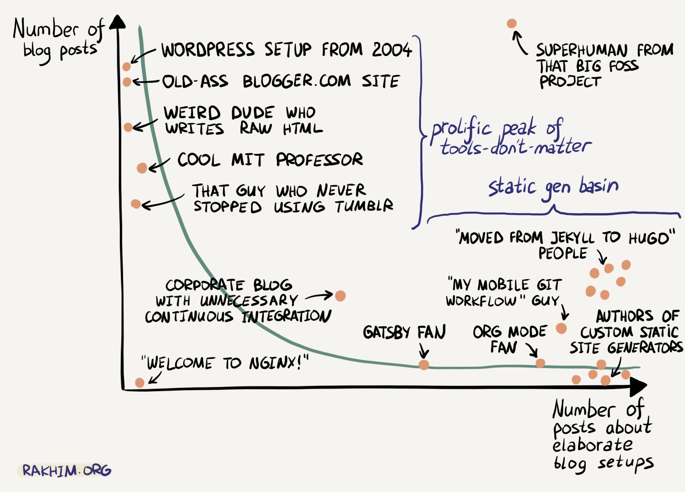
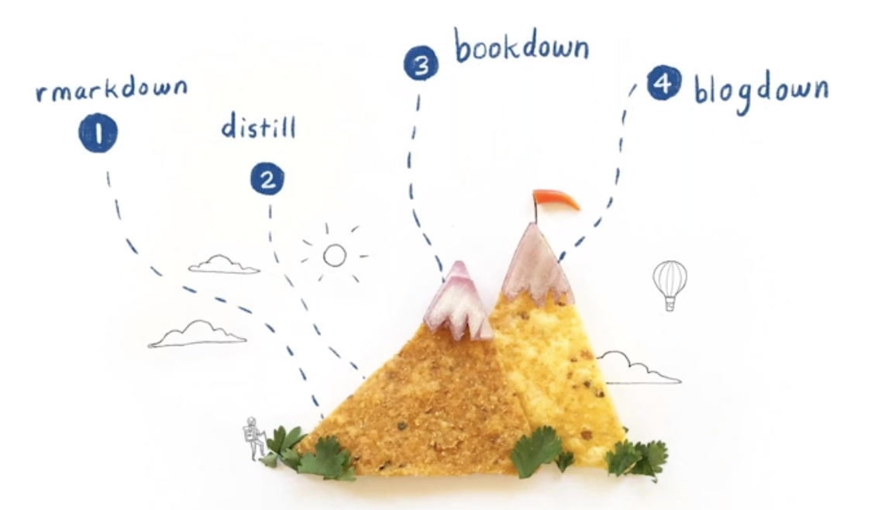

Så nå bytter jeg blogg-produksjons-system til [distill](https://rstudio.github.io/distill/). Blogdown var kjekt, men jeg brukte veeeldig få av mulighetene til custom theming og gøyale påfunn med Hugo. Jeg brukte derimot veeeldig mye tid på å få det til å funke, få lenkene mine til bilder og datasett til å bli riktige, til å få encodinga på alt til å snakke sammen og aksepter æ, ø og å. 

Nå er det ikke lenge siden sist jeg bytta fra wordpress, og jeg begynner å angre litt på det. Det er en viss fare for å ende opp et steg på høyresiden av denne kurva her:

Men, jeg liker det jeg ser så langt: 

- det er langt enklere enn blogdown, og har ingen avhengigheter til Hugo og de stadige endringene der. Det ser ut som en ganske enkel samling av HTML-filer og markdown?
- temaet er veldig standard og veldig lett, men kan tilpasses litt med CSS.

Ut ifra hva jeg kan se av introduksjonsmaterialet, er også Distill en god del enklere enn blogdown og bookdown. Blogdown er faktisk pekt på som den mest komplekse når du skal bestige R Markdown-fjellet.

Distill for RMarkdown er basert på [Distill-rammeverket for akademisk publisering](https://distill.pub/guide/), som er en enkel nettside som importerer funksjonalitet ved å source inn et predefinert sett med funksjonalitet med CSS, HTML og JS. 

Arbeidsflyten er mye den samme som i Blogdown:
- opprett en ny post
- endre encoding til UTF-8 (for å få med deilige nordiske bokstaver)
- knit den lokalt og se på resultatet
- commit til git, push til repo kobla til Netlify, og ta-da, se på automatisk oppdatert nettside.

Så gjenstår det bare å se om det faktisk blir noe mer blogging av dette. 

Noen ressurser jeg har hatt nytte av:

- [Dokumentasjonen for pakka](https://rstudio.github.io/distill/) 
- [Et bestiarium med ulike eksempler på sider laget med Distill](https://distillery.rbind.io/)
- Jenny Sloane sin tutorial for RGirls [(Youtube)](https://www.youtube.com/watch?v=YqnoSI6desg&list=PLpZT7JPM8_GZlqEssUJ6ABm0rblI1cBEW&index=4)
- [TheMockUp](https://themockup.blog/)
- [Piping Hot Data](https://www.pipinghotdata.com/blog)