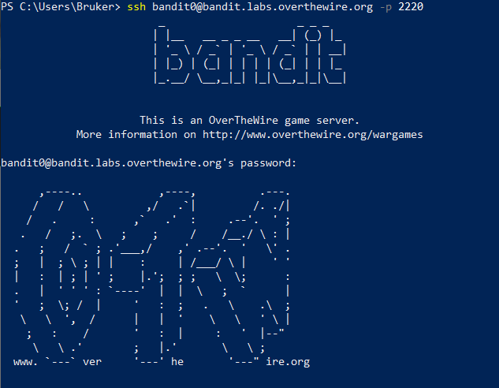

Etter anbefaling fra Bob Rudis (AKA hrbrmstr) sitt [daily drop-nyhetsbrev](https://dailydrop.hrbrmstr.dev/2023/10/25/drop-360-2023-10-25-its-all-fun-and-games/), har jeg prøvd meg litt på [OverTheWires Bandit-spill](https://overthewire.org/wargames/bandit/). 

Spillet er et intro-spill til såkalte wargames, men egentlig på et såpass grunnleggende nivå at det er et introspill til bruk av konsollet. Spillet består av 30 nivåer, der første utfordring er å i det hele tatt koble seg på game-serveren. 

Første gang jeg prøvde meg på det, brukte jeg en hel kveld før jeg skjønte at jeg hadde skrevet portnummeret feil. Instruksjonen om å lese instruksjonen nøye virker definitivt fornuftig. But one day, I got in!

De er forståelig nok ikke glade i at folk deler løsninger og slikt. Men å dokumentere reisen inn i det virker lurt.

Her er noe av det jeg har plukka opp så langt: 

- Noe av det første jeg lærte var at windows sin ledetekst (cmd/windows command shell) eller PowerShell kan brukes her, og det samme kan det å sette opp Windows Subsystem for Linux, og bruke Bash som CLI/terminal/shellderifra.
- Beslekta: command line, terminal og shell brukes om hverandre, men virker teknisk også litt ulike? 
- [WSL2](https://learn.microsoft.com/en-us/windows/wsl/about) er definitivt et eventyr i seg selv! Artig med litt linux i livet. Nevnte nyhetsbrev fra hrbrmstr kommer jevnlig med tips til CLI-verktøy og programmer som kjøres best fra Linux, eller krever kjennskap til Linux eller shell-basert arbeid. Microsoft sitt grunnkurs i bruken av WSL og å navigere mellom filsystemene [ligger her](https://learn.microsoft.com/en-us/training/modules/wsl-introduction/run-basic-commands).
- SSH: Secure shell, brukes til å logge seg på applikasjoner på en remote server, med gitte rettigheter knytta til sin bruker.
- Det er mange kommandoer.

