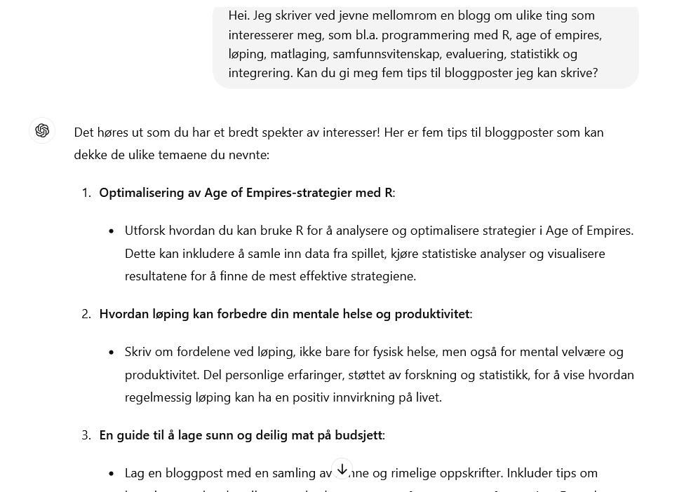
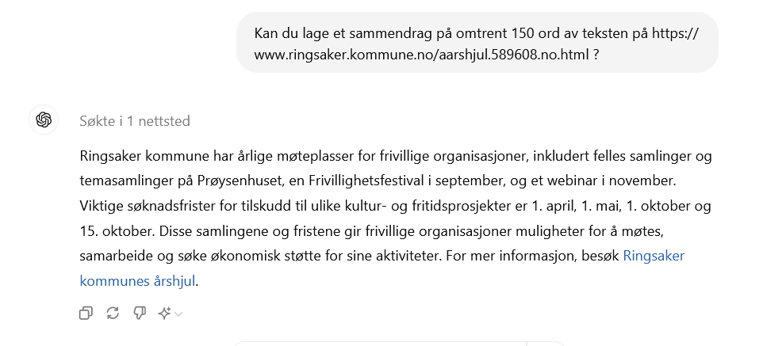
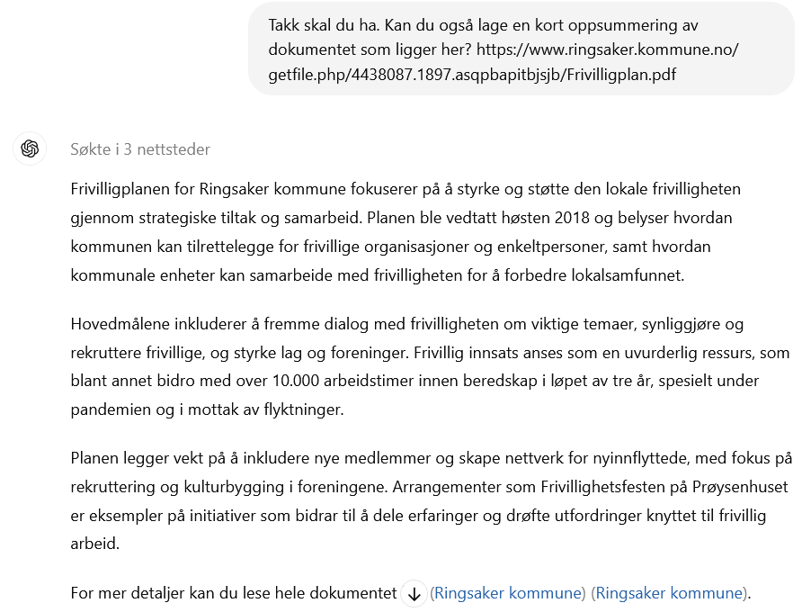

```{r setup, include=FALSE}

#library
library(tidyverse)

#settings
knitr::opts_chunk$set(echo = FALSE)
old = theme_set(theme_minimal())

#data
google_trends_ki <- read_csv("240609_google_trends_ki.csv",
                             col_types = cols(Uke = col_date(format = "%Y-%m-%d")),
                             skip = 1)

```

Store språkmodeller - Large Language Models (LLM) - er alle steder nå, det siste innen IT-relatert hype, og har bidratt til at Kunstig Intelligens har vært i nyhetene daglig de siste årene, siden ChatGPT ble offentlig tilgjengelig i slutten av november 2022.

```{r}
ggplot(data = google_trends_ki) +
  geom_line(aes(x = Uke, y = `Kunstig intelligens: (Norge)`)) +
  labs(title = "Søkeinteresse for KI på Google siste 5 år", subtitle = "Relativt til høyeste interessepunkt", x = "Tid")
``` 

I bunn og grunn er LLMer tekstprediksjonsmodeller trent på et veldig stort datasett med tekst, med svært mange parametre: blant de ledende modellene på HuggingFace sitt [open-llm-leaderbord](https://huggingface.co/spaces/open-llm-leaderboard/open_llm_leaderboard) finner vi finetunede versjoner av Metas Llama-3-70B, som er en modell med 70 milliarder parametre trent på datasett med 15 000 milliarder tokens (ord, setninger eller fraser). Dette gjør modellen i stand til å predikere tekst, noe som da kan brukes på ulike måter. Teknologien har vært kjent en stund, men med lanseringa av ChatGPT, så fikk folk flest et chatte-interface til en slik prediksjonsmodell.  

Det er definitivt gøy å chatte med en robot som ser ut til å forstå deg, og som er superkreativ. OpenAI har nå gjort den siste ChatGPT-versjonen, ChatGPT-4o, begrensa tilgjengelig for offentlig og gratis bruk (uten tvil for å få folk hekta nok til å bruke penger):

.

I tillegg har en konkurrenter som [Claude fra Anthropic](https://claude.ai/login?returnTo=%2F%3F) og [Microsofts Copilot](https://copilot.microsoft.com/) - og en haug andre.  Med implementeringer av konsepter som RAG - Retrieval Augmented Generation - kan en også få med seg lenker og et større snev av etterrettelighet. Perplexity AI er en godt fungerende søkemotor for dette, som i likhet med ChatGPT kan [tipse om blogg-innhold](https://www.perplexity.ai/search/I-write-a-n1ORmKczRqi08gwEG6r2Iw#0), men kan også gi for-og-imot-oppsummeringer med kilder (som her, om [skravurkart](https://www.perplexity.ai/search/Can-you-summarise-sTRJ0rkyTQ2G99jo7251iA#0)). 

## Men er det en boble? 

Og selv om dette er veldig underholdende, og potensielt nyttig - så kan det godt være en bobble. [Cory Doctorow skrev i 2023](https://locusmag.com/2023/12/commentary-cory-doctorow-what-kind-of-bubble-is-ai/) om hvordan det for han var åpenbart at den svært dyre teknologien bak kunstig intelligens ikke vil føre til tilsvarende inntjening: han har et interessant argument om at teknologien i liten grad vil gjøre arbeid billigere, unntatt tjenester med svært lav inntjening som f.eks. generering av RPG-bilder til ungdommer. For mange av de mer høytsvevende ambisjonene, som forskning, selvkjørende bil og automatisert saksbehandling, så ser det så langt heller ut til å gjøre gjøre dyrt arbeid bedre - men også dyrere. Hans konklusjon da var derfor at en heller enn å lure på om AI vil ta over verden, bør lure på om det vil være noe nyttig igjen når boblen sprekker. 

Når jeg spør Perplexiy om dette, peker den på at selv om det er en hype og verdisettingen på enkelte AI-selskap er høy og har steget voldsomt på kort tid, så er disse selskapene i mange tilfeller etablerte tech-selskaper med godt etablerte posisjoner (Microsoft og Nvidia er ikke det samme som et nettsideselskap på 90-tallet). Det tilsier at det bør være mindre sårbart enn en ren boble.

Den økonomiske siden av det skal jeg ikke påstå at jeg kjenner veldig godt. Men jeg ser at Daren Acemoglu, som kjenner økonomi svært godt, også mener det er grunn til å være skeptisk til hvor transformativ denne teknologien vil være. I [Dont' Believe The AI Hype](https://www.project-syndicate.org/commentary/ai-productivity-boom-forecasts-countered-by-theory-and-data-by-daron-acemoglu-2024-05) anslår han basert på faktisk forskning at total faktorproduktivitet kan øke med rundt 1 % totalt over de neste ti årene. Det er bra - men ikke et grensesprengende tall. 

Det kan heller ikke være tvil om at ressursbruken som trengs for å trene og kjøre de store modellene er svært høye - både [miljømessig og sosialt](https://theconversation.com/the-hidden-cost-of-the-ai-boom-social-and-environmental-exploitation-208669).  

Dermed er det altså gode grunner til å tenke som Doctorow, og se på hva en kan få ut av dette mens leken er god! 

## Så hva kan en gjøre med en LLM? 

### Les og oppsummer tekst!

Du kan få en modell til å lese tekst for deg og lage sammendrag. Jeg er skeptisk til bredden av dette use-caset for meg: de aller fleste akademiske artikler, rapporter og nyheter som er for lange til å leses raskt, er utstyrt med et godt skrevet sammendrag og en god ingress. I de aller fleste tilfeller vil jeg stole mer på forfatteren enn på maskinen. Å skrive et sammendrag av egen tekst er også en svært viktig del av skriveprosessen, i hvert fall for meg. 

Så da er kanskje behovet snarere å få oppsummering av tekster som ikke har et sammendrag - f.eks. en kommuneplan, en nettside, eller referater? Med ChatGPT-4o har også den tjenesten fått tilgang til internett-søk, og det kan dermed gjøres slik:

.

Den takler også PDF-er, ved å gjøre noen relaterte nettsøk:

.

### Kode kvalitative data. 

Når modellen kan lage et sammendrag - en prediksjon rundt hvilke ord som hører sammen med ordene i hovedteksten? - så bør den kanskje også kunne lage et veldig konsist sammendrag i form av koding av tekst? Chew m.fl. prøver dette i ["LLM-assisted content analysis: Using large language models to support deductive coding"](https://arxiv.org/pdf/2306.14924), og det finnes helt sikkert liknende forsøk der ute. Trikset her ser ut til å være å ikke overlate hele showet til en algoritme i en svart boks, men heller bruke LLMen som en yngre forskningsassistent, som du tester hele tiden: er de foreslåtte kodene meningsfulle i et lite utvalg, eller er det kun tilfeldig gjetninger? Oppfører den seg som forventa når den får "kodeboken", med eksempler på hvordan tekst skal kodes? I en annen artikkel jeg har lest (men ikke finner igjen nå), gjorde forskerne også et poeng ut av at LLM-kodingen ble gjennomført flere hundre ganger, og en tok "flertallsavgjørelsen" som den endelige kategorien. 

### Tale-til-tekst

[OpenAIs Whisper-modell](https://github.com/openai/whisper) er en veldig god tale-til-tekst-modell. Er det en LLM? Det er i hvert fall et nevralt nettverk med transformers. Den er imidlertid best på engelsk. Heldigvis har Nasjonalbiblioteket laget en versjon som kan norsk - [NB-Whisper](https://huggingface.co/NbAiLab/nb-whisper-large)

Og da har jeg ikke engang begynt å tenke på KI-assistert analyse av strukturerte data, noe f.eks. [Simon Willison](https://simonwillison.net/2024/Apr/17/ai-for-data-journalism/) har blogga om.

Får jeg kjørt disse på en effektiv måte? Her er det også et annet hensyn å ta: modellene bør kjøres lokalt hvis en skal gjøre noe med data som ikek skal deles med noen som tjener pengene sine på å trene modeller på alle data i hele verden.
